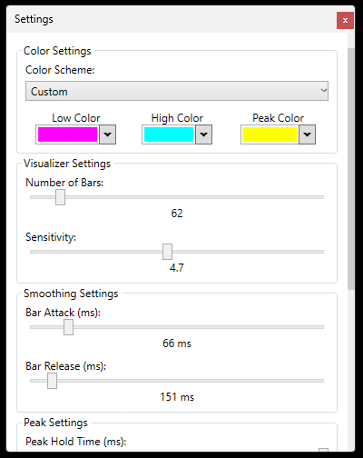

# BeAnal (Beat Analyzer)

[](https://github.com/spooonylove/beanal/releases/latest)
[](https://opensource.org/licenses/MIT)

A lightweight, highly configurable, real-time audio spectrum visualizer for your Windows desktop.

"BeAnal" captures all system audio (e.g., from Spotify, games, or web browsers) and displays it as a set of spectrum bars, right on your desktop.


---

## Features

* **System-Wide Audio Capture:** Visualizes any sound playing on your computer using NAudio's WASAPI loopback.
* **Fully Resizable:** Click and drag the bottom-right corner to resize the window to any shape.
* **Always on Top:** A simple checkbox keeps the visualizer pinned above all other windows.
* **Detailed Customization:** Right-click the window to access settings:
    * **Visuals:** Adjust the number of frequncy bars (from 10 to 512), sensitivity, and color schemes (including custom gradients).
    * **Smoothing:** Fine-tune the "attack" and "release" times for the bars to create a smooth or responsive feel.
    * **Peaks:** Enable peak-hold indicators with their own separate hold and release timers.
    * **Opacity:** Set the transparency for both the bars and the background canvas independently.
* **Persistent Settings:** All your settings are automatically saved and reloaded every time you start the app.

## Getting Started

### 1. Download the Latest Release

The easiest way to get started is to download the latest beta release.

1.  Go to the [**Releases Page**](https://github.com/spooonylove/beanal/releases/latest).
2.  Download the `.zip` file (e.g., `BeAnal-v0.1-beta.zip`).
3.  Unzip the entire folder to a location of your choice.
4.  Run `BeAnal.Wpf.exe`.

*This is a self-contained release, so you do not need to install any .NET runtimes.*

### 2. Usage

* **Move:** Click and drag anywhere on the visualizer to move it.
* **Resize:** Click and drag the grey grip in the bottom-right corner.
* **Configure:** Right-click anywhere on the visualizer to open the context menu. Select "Settings..." to open the configuration panel or "Exit" to close the application.



## Building From Source

If you are a developer and want to build the project yourself:

1.  Clone the repository:
    ```bash
    git clone [https://github.com/spooonylove/beanal.git](https://github.com/spooonylove/beanal.git)
    ```
2.  Open the `BeAnal.slnx` file in Visual Studio 2022 (or later).
3.  Ensure you have the .NET 10.0 SDK installed.
4.  Build and run the `BeAnal.Wpf` project.

## Contributing

Contributions, issues, and feature requests are welcome! Feel free to open an issue or submit a pull request.

## License

This project is licensed under the **MIT License** - see the [LICENSE](LICENSE) file for details.